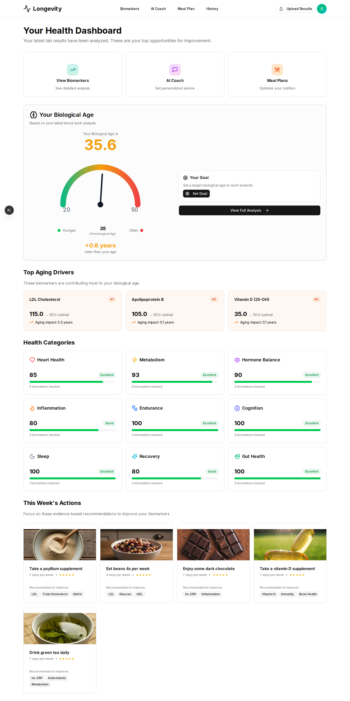

# 🧬 Longevity

Longevity is an open-source platform designed to transform your blood data into actionable insights. Discover your biological age, optimize your health markers, and get personalized AI coaching to live longer and better!

[](https://v0.app)
[](https://vercel.com)



---

## ✨ Features

- **Biological Age Calculation**: Calculate your "Inner Age" using 48 blood biomarkers and identify what markers are affecting your aging.
- **Holistic Health Tracking**: Monitor 6 key health pillars including Heart Health, Metabolism, Hormones, Inflammation, Nutrients, and Endurance.
- **AI-Powered Coaching**: Receive personalized, scientifically-backed recommendations, meal plans, and habit tracking to improve your biomarkers week by week.
- **Privacy-First Architecture**: Your data stays strictly on your device or personal cloud storage. We never store personal health information on our servers, ensuring complete ownership and control.

---

## 🚀 Getting Started

It's super easy to run Longevity on your local machine. Follow the steps below:

### Prerequisites

- [Node.js](https://nodejs.org/) (version 18 or higher)
- `npm` or `yarn`

### Installation

1. **Clone the repository:**
   ```bash
   git clone https://github.com/richardsondx/longevity.git
   cd longevity
   ```

2. **Install dependencies:**
   ```bash
   npm install
   ```

3. **Start the development server:**
   ```bash
   npm run dev
   ```

4. **Launch the app:**  
   Open [http://localhost:3000](http://localhost:3000) in your browser to see the app running!

---

## 👥 Author

Created by **Richardson Dackam**  
🐦 Connect on Twitter/X: [@richardsondx](https://x.com/richardsondx)

---

## ⚖️ Disclaimer & Legal Notice

**MEDICAL DISCLAIMER FOR US, CANADA, EUROPE, AND WORLDWIDE**

The Longevity platform, its algorithms, AI coaching logic, and all generated content are provided strictly for **educational, tracking, and informational purposes only**. This software **does not** provide medical advice, diagnosis, or treatment.

By accessing, running, modifying, or using this open-source software, you expressly acknowledge and agree to the following conditions:
- **Not Medical Advice**: This tool is **not** a substitute for professional medical advice, consultation, or clinical care. 
- **Consult Professionals**: You must **always** consult with a licensed physician, clinician, or qualified healthcare provider in your specific jurisdiction (including but not limited to the US, Canada, and the EU/UK) before making any decisions or changes regarding your health, medical treatments, diet, or exercise routines.
- **No Liability**: The author(s), creator(s), and contributors of this open-source project are **completely free of any liability** for any physical harm, medical complications, or other consequences that may arise from actions taken based on the data, insights, or logic generated by this platform. 
- **User Responsibility**: You assume 100% of the risk and responsibility for how you utilize any health data, "biological age" scores, or recommendations produced by this application. 

*Please rely entirely on your licensed healthcare practitioners for actionable medical decisions.*

---

## 📜 License

This project is open-source. Please check the `LICENSE` file for more details.